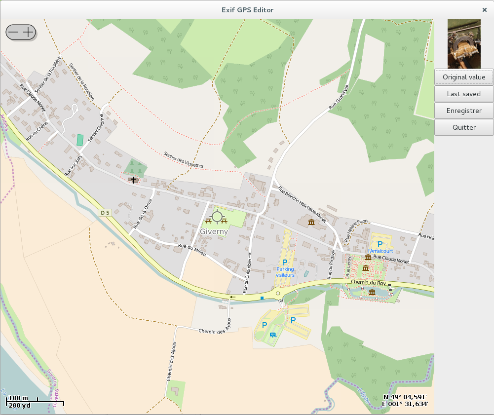

Exif GPS Editor
===============

Exif GPS Editor is a GUI program allows you to modify the GPS coordinates of an
image.

It uses OpenStreetMap to display the map and Exiv2 to read and write Exif data
from/to the image.

Using Exiv2 means Exif GPS Editor can read and write any file format supported
by Exiv2 (though the preview is limited to file formats supported by GTK 3).

This means you can modify GPS coordinates for JPG, TIFF, RAW, etc.

Requirements
------------

Exif GPS Editor uses Python 3 and GTK 3.

The following libraries must be installed:

- gir1.2-osmgpsmap-1.0
- python-gi-cairo
- gir1.2-gexiv2-0.10

TODO
----

Create an installer
Be more compliant with Python standards for application delivery

Developers
----------

In order to modify the Glade file, you should add the osmgsmmap-catalog.xml in
a directory accessible to Glade.

